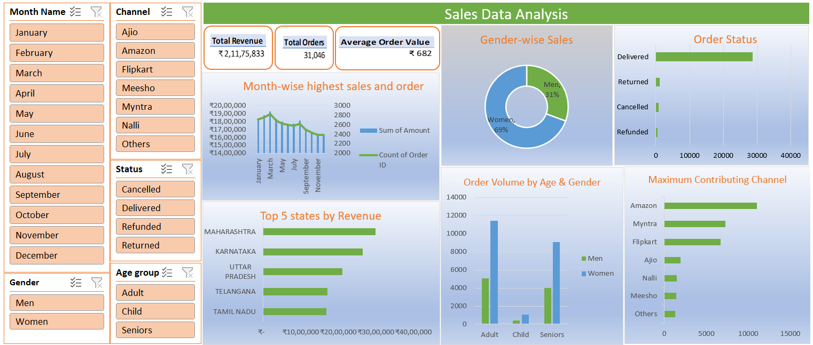

# 📊 E-Commerce Sales Performance & Customer Demographics Dashboard

## 📌 Project Overview
Analyzed over **31,000 sales transactions** to evaluate monthly revenue trends, customer demographics (gender & age groups), fulfillment performance, and sales channel effectiveness (Amazon, Myntra, Flipkart, Ajio, etc.).

---

## 📸 Dashboard Preview

---

## 🎯 Key Business Insights
* **Top Sales Channels:** **Amazon** leads overall order volume (~11,000+ orders), followed by **Myntra** (~7,200+) and **Flipkart** (~6,700+).
* **Customer Demographics:** **Women** represent ~69% of all orders, with the **Adult (ages 30–49)** segment generating the highest purchase volume.
* **Geographic Performance:** **Maharashtra** (~₹2.99M) and **Karnataka** (~₹2.64M) are the top two revenue-generating states.
* **Order Fulfillment:** ~92% of all orders were successfully delivered, with cancellations and returns staying below 6%.

---

## 🛠️ Tools & Technical Highlights
* **Tool:** Microsoft Excel
* **Data Preparation:** Categorical binning (`Age group`), date extraction, data type standardization, missing value handling.
* **Data Aggregation:** Dynamic Pivot Tables, multi-variable summaries, and conditional calculations.
* **Data Visualization:** Executive KPI summary cards, customized dynamic bar and line charts, donut chart with percentage labels, and interactive slicer controls.
